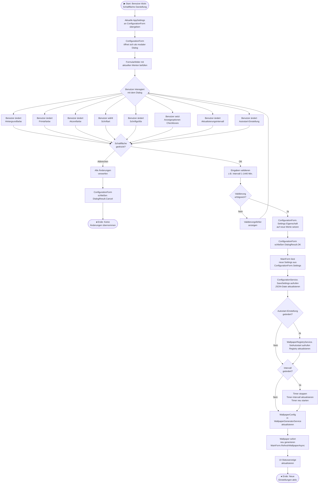
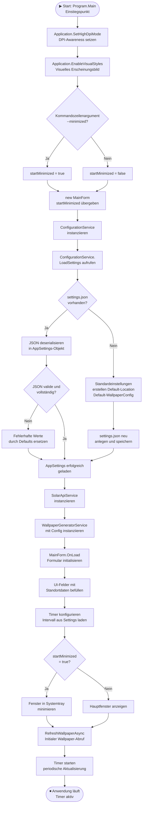

# Aktivitätsdiagramm

## Sonnenuhr – Standortspezifischer Wallpaper-Generator für Windows 11

---

| Feld | Inhalt |
|------|--------|
| **Projektname** | Sonnenuhr – Wallpaper-Generator |
| **Prüfling** | Uwe Markus Münch |
| **Stand** | 01.07.2026 |
| **Version** | 1.0 |

---

## Inhaltsverzeichnis

1. [Hauptworkflow: Wallpaper-Generierung](#1-hauptworkflow-wallpaper-generierung)
2. [Workflow: Konfigurationsänderung](#2-workflow-konfigurationsänderung)
3. [Workflow: Anwendungsstart](#3-workflow-anwendungsstart)
4. [Workflow: Stadtsuche](#4-workflow-stadtsuche)
5. [Workflow: Animierter Hintergrund – DrawBackground](#5-workflow-animierter-hintergrund--drawbackground)

---

## 1. Hauptworkflow: Wallpaper-Generierung

### 1.1 Beschreibung

Dieser Workflow beschreibt den zentralen Ablauf der Anwendung: Die periodische oder manuell ausgelöste Aktualisierung des Desktop-Wallpapers. Der Prozess beginnt nach dem erfolgreichen Start der Anwendung und dem Laden der Konfiguration. Er wird entweder durch den internen Timer (automatisch im konfigurierten Intervall) oder durch einen manuellen Klick des Benutzers auf die Schaltfläche „Jetzt aktualisieren" ausgelöst.

Der Workflow gliedert sich in drei funktionale Hauptbereiche:
1. **Datenbeschaffung:** Abruf der aktuellen Sonnendaten von der externen API
2. **Bildgenerierung:** Berechnung der Sonnenuhr-Geometrie und Zeichnen des Wallpaper-Bildes
3. **Systemintegration:** Setzen des Wallpapers über die Windows Registry und Aktualisierung der Benutzeroberfläche

### 1.2 Aktivitätsdiagramm

```mermaid
flowchart TD
    A([▶ Start: Timer-Tick oder\nManuell ausgelöst]) --> B[Anwendung prüft\nAktualisierungstrigger]
    B --> C{Netzwerk\nverfügbar?}

    C -- Nein --> D[Fehlermeldung in\nStatusbar anzeigen:\nKeine Netzwerkverbindung]
    D --> E[Letztes Wallpaper\nbleibt bestehen]
    E --> Z([⏹ Ende: Warten auf\nnächsten Trigger])

    C -- Ja --> F[HTTP GET an\nsunrise-sunset.org API\nSolarApiService.GetTodaySolarDataAsync]
    F --> G{API-Antwort\nerhalten?}

    G -- Timeout / Fehler --> H[Fehler protokollieren\nin sonnenuhr.log]
    H --> I[Status anzeigen:\nAPI nicht erreichbar]
    I --> Z

    G -- HTTP 200 OK --> J[JSON-Response\ndeserialisieren]
    J --> K{Status in JSON\n= OK?}

    K -- Nein --> L[API-Fehler protokollieren\nund Status anzeigen]
    L --> Z

    K -- Ja --> M[SolarData-Objekt\nbefüllen und\nZeitzonen konvertieren]
    M --> N[Aktuelle Uhrzeit\nermitteln DateTime.Now]

    N --> O[SundialCalculator.\nCalculateAllHourLines\nBreitengrad übergeben]
    O --> P[Stundenlinienwinkel\nals Dictionary erhalten\nHour → Angle in Grad]

    P --> Q[SundialCalculator.\nCalculateCurrentShadowAngle\naktuelle Zeit und Noon übergeben]
    Q --> R{Sonne über\nHorizont?}

    R -- Nein Nacht --> S[Schattenzeiger\nnicht zeichnen\nnull-Wert]
    R -- Ja --> T[Schattenwinkel\nberechnet]

    S --> U[WallpaperGeneratorService.\nGenerateWallpaper aufrufen]
    T --> U

    U --> V[GDI+ Bitmap erstellen\n1920x1080 px]
    V --> W[Hintergrund mit\nGradient füllen]
    W --> X[Zifferblatt-Kreis\nzeichnen]
    X --> Y1[Stundenlinien\neinzeichnen]
    Y1 --> Y2[Stundenbeschriftungen\nhinzufügen]
    Y2 --> Y3[Gnomon-Symbol\nzeichnen]
    Y3 --> Y4{Schatten-\nzeiger aktiv?}

    Y4 -- Ja --> Y5[Aktuellen Schattenzeiger\neinzeichnen]
    Y4 -- Nein --> Y6

    Y5 --> Y6{Optionale\nElemente}
    Y6 -- ShowSunriseSunset --> Y7[Sonnenaufgang- und\nUntergangslinie einzeichnen]
    Y6 --> Y8{ShowCurrentTime}
    Y7 --> Y8
    Y8 -- Ja --> Y9[Aktuelle Uhrzeit\nauf Bild schreiben]
    Y8 --> Y10{ShowLocationName}
    Y9 --> Y10
    Y10 -- Ja --> Y11[Ortsnamen\nauf Bild schreiben]
    Y10 --> AA

    Y11 --> AA[Bitmap als PNG\nspeichern unter\n%APPDATA%\\Sonnenuhr\\wallpaper.png]
    AA --> BB[WallpaperRegistryService.\nSetWallpaper aufrufen]
    BB --> CC[Registry-Eintrag schreiben\nHKCU\\Control Panel\\Desktop\\Wallpaper]
    CC --> DD[SystemParametersInfo\nSPI_SETDESKWALLPAPER aufrufen]
    DD --> EE[Desktop-Hintergrund\nwird aktualisiert]
    EE --> FF[MainForm UI aktualisieren:\nSonnendaten anzeigen]
    FF --> GG[Statusbar: Letztes Update\nZeitstempel anzeigen]
    GG --> Z
```



### 1.3 Erläuterung der Entscheidungspunkte

| Entscheidungspunkt | Bedingung | Verzweigung |
|---------------------|-----------|-------------|
| **Netzwerk verfügbar?** | `NetworkInterface.GetIsNetworkAvailable()` gibt `true` zurück | Nein → Fehlermeldung; Ja → API-Aufruf |
| **API-Antwort erhalten?** | HTTP-Status 200 und kein Timeout (10s) | Timeout/Fehler → Log; OK → Deserialisierung |
| **Status in JSON = OK?** | `response.status == "OK"` | Nein → Fehlerlog; Ja → Datenverarbeitung |
| **Sonne über Horizont?** | `CalculateCurrentShadowAngle()` gibt nicht `null` zurück | Nein → kein Schattenzeiger; Ja → Winkel vorhanden |
| **Optionale Elemente** | Boolesche Felder in `WallpaperConfig` | Jeweils individuell konfigurierbar |

---

## 2. Workflow: Konfigurationsänderung

### 2.1 Beschreibung

Dieser Workflow beschreibt den Ablauf, wenn der Benutzer die Anwendungskonfiguration über den Konfigurationsdialog ändert. Der Benutzer kann Farben, Schriftarten und Anzeigeoptionen für das generierte Wallpaper anpassen sowie den Aktualisierungsintervall und den Autostart-Status ändern.

Nach dem Bestätigen der Änderungen werden die neuen Einstellungen sofort auf die Anwendung angewendet: Der Timer wird mit dem neuen Intervall neu gestartet, und das Wallpaper wird unmittelbar neu generiert, sodass der Benutzer die Auswirkungen der Änderungen sofort sieht.

### 2.2 Aktivitätsdiagramm



### 2.3 Erläuterung des Konfigurationsworkflows

Der Konfigurationsdialog arbeitet nach dem **Modaldialog-Muster**: Er öffnet sich als modales Fenster und blockiert das Hauptfenster. Das `MainForm` übergibt eine Referenz auf die aktuellen Einstellungen. Nach dem Schließen mit „OK" werden die neuen Einstellungen übernommen.

Die wichtigsten Aspekte dieses Workflows:

- **Validation:** Bevor Einstellungen gespeichert werden, erfolgt eine clientseitige Validierung aller Eingaben.
- **Persistenz:** Nach jeder Änderung werden die Einstellungen sofort in die JSON-Datei geschrieben, um Datenverlust zu vermeiden.
- **Sofortige Vorschau:** Das Wallpaper wird unmittelbar nach dem Speichern neu generiert.
- **Registry-Synchronisation:** Änderungen am Autostart-Status werden sofort in die Windows Registry übertragen.

---

## 3. Workflow: Anwendungsstart

### 3.1 Beschreibung

Dieser Workflow beschreibt den vollständigen Initialisierungsablauf der Anwendung von dem Moment an, in dem der Benutzer die ausführbare Datei startet oder der Windows-Autostart die Anwendung lädt.

### 3.2 Aktivitätsdiagramm



### 3.3 Erläuterung des Startvorgangs

| Schritt | Beschreibung |
|---------|--------------|
| **DPI-Awareness** | Die Anwendung konfiguriert High-DPI-Unterstützung, um auf hochauflösenden Monitoren korrekt dargestellt zu werden. |
| **Settings laden** | Beim ersten Start existiert keine Konfigurationsdatei; in diesem Fall werden sinnvolle Standardwerte verwendet und die Datei wird neu erstellt. |
| **Fehlertoleranz** | Wenn die vorhandene JSON-Datei korrumpiert oder unvollständig ist, werden ungültige Felder durch Standardwerte ersetzt, statt die Anwendung zu beenden. |
| **Initialer Wallpaper-Abruf** | Nach dem Start wird sofort einmalig ein Wallpaper generiert, damit der Benutzer nicht auf den ersten Timer-Tick warten muss. |
| **Minimierter Start** | Wenn die Anwendung über den Windows-Autostart gestartet wird, erscheint sie nicht im Vordergrund, sondern startet direkt minimiert im Systemtray. |

---

## 4. Workflow: Stadtsuche

### 4.1 Beschreibung

Dieser Workflow beschreibt den Ablauf der Stadtsuche-Funktion. Der Benutzer gibt einen
Städtenamen in das Ortsname-Feld ein und klickt auf den Suchen-Button. Die Anwendung
ruft die OpenStreetMap Nominatim API ab, wertet die Ergebnisse aus und übernimmt die
Koordinaten automatisch in die Eingabefelder.

### 4.2 Aktivitätsdiagramm

```mermaid
flowchart TD
    A([▶ Start: Benutzer klickt\n"Suchen"-Button]) --> B{Stadtname-Feld\nleer?}

    B -- Ja --> C[Hinweisdialog anzeigen:\nBitte Stadtnamen eingeben]
    C --> Z([⏹ Ende: Abgebrochen])

    B -- Nein --> D[Suchbegriff aus txtLocationName lesen\nSchaltfläche deaktivieren]
    D --> E[GeocodingService.\nSearchCityAsync aufrufen]

    E --> F{HTTP-Request\nerfolgreich?}

    F -- Netzwerkfehler --> G[HttpRequestException abfangen\nFehler-MessageBox anzeigen]
    G --> H[btnCitySearch.Enabled = true\nStatus: Fehler bei Stadtsuche]
    H --> Z

    F -- Erfolg --> I[JSON-Antwort deserialisieren\nNach Importance sortieren]
    I --> J{Anzahl\nTreffer?}

    J -- 0 Treffer --> K[MessageBox: Keine Orte gefunden\nTipp: Länderzusatz verwenden]
    K --> L[Status: Bereit]
    L --> Z

    J -- 1 Treffer --> M[ApplyCityResult aufrufen\nDirekter Einzeltreffer]
    M --> N[txtLocationName = ShortName\ntxtLatitude = Latitude\ntxtLongitude = Longitude]
    N --> O[Settings speichern\nlblLocationDisplay aktualisieren]
    O --> P[Status: Standort übernommen]
    P --> Z

    J -- Mehrere Treffer --> Q[CitySelectionForm erstellen\nMit Trefferliste befüllen]
    Q --> R[Dialog als modale\nAnzeige öffnen]
    R --> S{Benutzer-\nAktion?}

    S -- Abbrechen --> T[Keine Änderungen\nDialog schließen]
    T --> Z

    S -- Auswählen --> U[Gewählten GeocodingResult\naus SelectedResult lesen]
    U --> M
```

### 4.3 Erläuterung der Entscheidungspunkte

| Entscheidungspunkt | Bedingung | Verzweigung |
|---|---|---|
| **Stadtname leer?** | `string.IsNullOrWhiteSpace(txtLocationName.Text)` | Ja → Hinweis; Nein → API-Aufruf |
| **HTTP-Request erfolgreich?** | Kein Timeout, kein Netzwerkfehler | Fehler → Fehlerdialog; Erfolg → Deserialisierung |
| **Anzahl Treffer?** | `results.Count` | 0 → Meldung; 1 → Direkte Übernahme; >1 → Auswahldialog |
| **Benutzer-Aktion im Dialog** | Klick auf „Auswählen" oder „Abbrechen" | Abbrechen → keine Änderung; Auswählen → ApplyCityResult |

---

## 5. Workflow: Animierter Hintergrund – DrawBackground

### 5.1 Beschreibung

Dieser Workflow beschreibt den Entscheidungsbaum innerhalb der Methode `DrawBackground()` des `WallpaperGeneratorService`. Die Methode wird einmal pro Wallpaper-Generierung aufgerufen und zeichnet den vollständigen, tageszeit­abhängigen Hintergrund auf den GDI+-`Graphics`-Kontext.

Der Ablauf gliedert sich in drei unbedingt ausgeführte Phasen (Himmelsfarbe, Sterne, Horizontglühen) und eine bedingte Phase, die je nach Tageszeit entweder die Sonne oder den Mond zeichnet.

### 5.2 Aktivitätsdiagramm

```mermaid
flowchart TD
    A([▶ Start: DrawBackground\ng, currentTime, sunrise, sunset]) --> B[GetSkyColors\ncurrentTime sunrise sunset]

    B --> C[7 Farbstützpunkte interpolieren\nTiefe Nacht → Dämmerungsstufen\n→ Sonnenauf-untergang → Tag]
    C --> D[LinearGradientBrush erstellen\ntopColor → horizonColor\nHintergrundrechteck füllen]

    D --> E[DrawStars aufrufen\ncurrentTime sunrise sunset horizonY]
    E --> F{Sterne sichtbar?\n60 min vor Aufgang\noder nach Untergang}
    F -- Ja → Einblenden --> G[180 Sterne deterministisch\nSeed = aktuelles Datum\nSanftes Fade-In / Fade-Out\nstündliches Flackern]
    F -- Nein Tag --> H[Sterne nicht zeichnen\nAlpha = 0]
    G --> I
    H --> I

    I[DrawHorizonGlow aufrufen\ncurrentTime sunrise sunset horizonY]
    I --> J{Nahe Horizont?\nDelta zu Auf- oder\nUntergang ≤ 60 min}
    J -- Ja --> K[Alpha proportional zur Nähe\nPathGradientBrush\norangefarbener Ellipsen-Glow\nam Horizont]
    J -- Nein --> L[Kein Horizontglühen\nAlpha = 0]
    K --> M
    L --> M

    M{Tag oder Nacht?\ncurrentTime zwischen\nsunrise und sunset}

    M -- Tag --> N[sunT berechnen\nt = currentTime minus sunrise\ndividiert durch sunset minus sunrise\n0 = Aufgang 1 = Untergang]
    N --> O[CalculateCelestialPosition\nsunT imageWidth horizonY\nSinusbogen-Trajektorie]
    O --> P[GetCelestialAlpha\nisDaytime = true\n±20 min Fade am Horizont]
    P --> Q[DrawSun\npos alpha\n5 Glow-Schichten + Halo\n+ Scheibe + Kern]
    Q --> Z

    M -- Nacht --> R[CalculateMoonT\ncurrentTime sunrise sunset\n0 = Sonnenuntergang\n1 = Sonnenaufgang nächster Tag]
    R --> S[CalculateCelestialPosition\nmoonT imageWidth horizonY]
    S --> T[GetCelestialAlpha\nisDaytime = false]
    T --> U[CalculateMoonPhase\nSynodischer Monat 29.53 Tage\nReferenz Neumond 06.01.2000\n0 = Neumond 0.5 = Vollmond]
    U --> V[DrawMoon\npos alpha phase\nGlow + Mondscheibe\n+ Phasenüberlagerung]
    V --> Z

    Z([⏹ Ende: Hintergrund gezeichnet\nWeiter mit Sonnenuhr-Elementen])
```



### 5.3 Erläuterung der Entscheidungspunkte

| Entscheidungspunkt | Bedingung | Verzweigung |
|---|---|---|
| **Sterne sichtbar?** | `currentTime` liegt innerhalb 60 min vor Sonnenaufgang oder nach Sonnenuntergang (Nacht) | Ja → Einblenden mit Fade; Nein → kein Zeichnen |
| **Nahe Horizont?** | `|currentTime − localSunrise| ≤ 60 min` oder `|currentTime − localSunset| ≤ 60 min` | Ja → orangefarbener Ellipsen-Glow proportional zur Nähe |
| **Tag oder Nacht?** | `currentTime` liegt zwischen `localSunrise` und `localSunset` | Tag → `DrawSun()` mit `sunT`-Fortschritt; Nacht → `DrawMoon()` mit `moonT`-Fortschritt |
| **Mondphase** | Berechnung via `CalculateMoonPhase()` liefert Wert 0–1 | 0–0,5 = zunehmend (Schatten links); 0,5–1 = abnehmend (Schatten rechts) |
| **Alpha-Überblendung** | ±20 min nahe Horizont für Sonne und Mond | Sanftes Einblenden (`float 0.0 → 1.0`) über `GetCelestialAlpha()` |

---

## 6. Workflow: 3D-Sonnenuhr-Projektion (Meilenstein 1)

```mermaid
flowchart TD
    A([Start: DrawPerspectiveSundial]) --> B[Orientierung auflösen\nAutomatic/Nord oben/Süd oben]
    B --> C[SolarPosition lokal berechnen\nSonnenhöhe + Sonnenazimut]
    C --> D[Dial als Ellipse zeichnen\nMaterial + Bevel]
    D --> E[Tages-Hemisphäre markieren\nHalbsektor statt Vollkreisfokus]
    E --> F[Stundenlinien auf Plattenebene berechnen]
    F --> G[Ansichtstransformation anwenden\n(nur visuell, nicht physikalisch)]
    G --> H[Gnomon geneigt nach Breite zeichnen]
    H --> I{Sonne über Horizont?}
    I -- Ja --> J[Schattenrichtung = Azimut + 180°]
    J --> K[Schattenlänge = f(Sonnenhöhe)\n1/tan(Altitude)]
    K --> L[Schatten auf Platte projizieren]
    I -- Nein --> M[Kein Schatten zeichnen]
    L --> N([Ende])
    M --> N
```

---

*Dokument erstellt von: Uwe Markus Münch | Breihof IT GmbH | IHK Rhein-Neckar | 01.07.2026*
