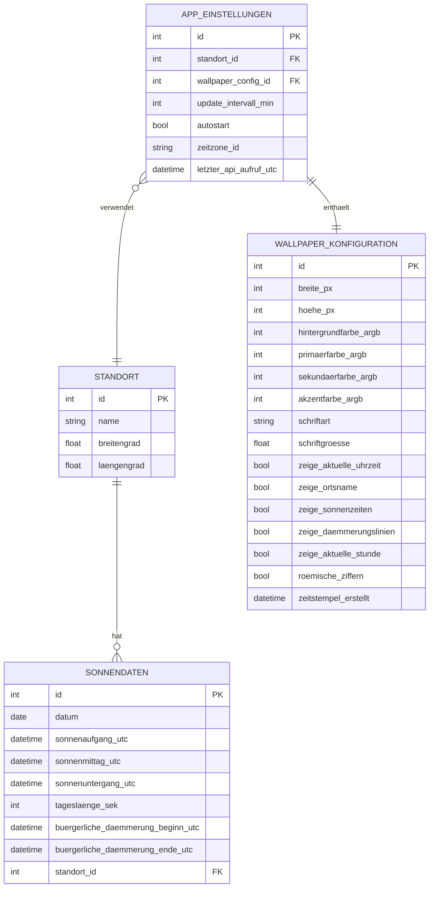

# ER-Diagramm (Datenbankmodell / Datenstruktur)

## Sonnenuhr – Standortspezifischer Wallpaper-Generator für Windows 11

---

| Feld | Inhalt |
|------|--------|
| **Projektname** | Sonnenuhr – Wallpaper-Generator |
| **Prüfling** | Uwe Markus Münch |
| **Stand** | 01.07.2026 |
| **Version** | 1.0 |

---

## Vorbemerkung

Die Sonnenuhr-Anwendung verwendet **keine relationale Datenbank**. Die Datenpersistierung erfolgt ausschließlich über eine JSON-Konfigurationsdatei im Benutzerprofilverzeichnis (`%APPDATA%\Sonnenuhr\settings.json`).

Das vorliegende ER-Diagramm stellt die **logische Datenstruktur** der Anwendung dar – d.h. es zeigt, wie die Entitäten der Anwendung in Beziehung zueinander stehen, auch wenn diese Beziehungen nicht durch Fremdschlüssel in einer relationalen Datenbank, sondern durch verschachtelte JSON-Objekte und Referenzen im Objektmodell realisiert werden.

Das Diagramm eignet sich als konzeptionelle Grundlage, falls die Anwendung in einer späteren Version auf eine Datenbank (z.B. SQLite) migriert werden sollte.

---

## ER-Diagramm



---

## Entitätsbeschreibungen

### STANDORT

Die Entität `STANDORT` repräsentiert einen geografischen Ort, für den Sonnenzeitdaten abgerufen werden. In der aktuellen Version der Anwendung gibt es genau **einen** aktiven Standort pro Benutzerprofil.

| Attribut | Typ | Beschreibung |
|----------|-----|--------------|
| `id` | Integer (PK) | Eindeutiger Primärschlüssel (automatisch vergeben) |
| `name` | String | Benutzerfreundlicher Name des Standorts (z.B. „Mannheim") |
| `breitengrad` | Float | Geografischer Breitengrad in Dezimalgrad (−90° bis +90°) |
| `laengengrad` | Float | Geografischer Längengrad in Dezimalgrad (−180° bis +180°) |

**Entsprechende C#-Klasse:** `Models.Location`

**JSON-Repräsentation:**
```json
{
  "Name": "Mannheim",
  "Latitude": 49.4875,
  "Longitude": 8.4660
}
```

**Validierungsregeln:**
- `breitengrad` muss im Bereich [−90, +90] liegen
- `laengengrad` muss im Bereich [−180, +180] liegen
- `name` darf nicht leer oder null sein

---

### SONNENDATEN

Die Entität `SONNENDATEN` speichert die von der Sunrise-Sunset-API abgerufenen astronomischen Tagesdaten für einen spezifischen Standort und ein spezifisches Datum.

| Attribut | Typ | Beschreibung |
|----------|-----|--------------|
| `id` | Integer (PK) | Eindeutiger Primärschlüssel |
| `datum` | Date | Das Datum, für das die Daten abgerufen wurden (ISO 8601) |
| `sonnenaufgang_utc` | DateTime | Zeitpunkt des Sonnenaufgangs in UTC |
| `sonnenmittag_utc` | DateTime | Zeitpunkt des Sonnenmittags (Solar Noon) in UTC |
| `sonnenuntergang_utc` | DateTime | Zeitpunkt des Sonnenuntergangs in UTC |
| `tageslaenge_sek` | Integer | Tageslänge in Sekunden |
| `buergerliche_daemmerung_beginn_utc` | DateTime | Beginn der bürgerlichen Dämmerung morgens in UTC |
| `buergerliche_daemmerung_ende_utc` | DateTime | Ende der bürgerlichen Dämmerung abends in UTC |
| `standort_id` | Integer (FK → STANDORT) | Referenz auf den zugehörigen Standort |

**Entsprechende C#-Klasse:** `Models.SolarData`

**Hinweis:** In der aktuellen Implementierung werden Sonnendaten nicht persistent gespeichert. Sie werden bei jedem Aktualisierungsvorgang neu von der API abgerufen und im Arbeitsspeicher gehalten. Eine zukünftige Version könnte einen lokalen Cache implementieren, um API-Aufrufe zu reduzieren.

---

### WALLPAPER_KONFIGURATION

Die Entität `WALLPAPER_KONFIGURATION` enthält alle Darstellungsparameter für das zu generierende Wallpaper-Bild.

| Attribut | Typ | Beschreibung |
|----------|-----|--------------|
| `id` | Integer (PK) | Eindeutiger Primärschlüssel |
| `breite_px` | Integer | Bildbreite in Pixeln (Standard: 1920) |
| `hoehe_px` | Integer | Bildhöhe in Pixeln (Standard: 1080) |
| `hintergrundfarbe_argb` | Integer | Hintergrundfarbe als ARGB-Integer (z.B. `FF1A1A2E` → Dunkelblau) |
| `primaerfarbe_argb` | Integer | Primärfarbe als ARGB-Integer (z.B. `FFFFD700` → Gold) |
| `sekundaerfarbe_argb` | Integer | Sekundärfarbe als ARGB-Integer (z.B. `FFFFFFFF` → Weiß) |
| `akzentfarbe_argb` | Integer | Akzentfarbe als ARGB-Integer (z.B. `FFFF8C00` → Orange) |
| `schriftart` | String | Schriftfamilie (z.B. „Segoe UI", „Times New Roman") |
| `schriftgroesse` | Float | Basisschriftgröße in Punkt (z.B. 14.0) |
| `zeige_aktuelle_uhrzeit` | Boolean | Gibt an, ob die aktuelle Uhrzeit im Bild angezeigt wird |
| `zeige_ortsname` | Boolean | Gibt an, ob der Ortsname im Bild angezeigt wird |
| `zeige_sonnenzeiten` | Boolean | Gibt an, ob Sonnenaufgangs- und -untergangszeiten im Bild stehen |
| `zeige_daemmerungslinien` | Boolean | Gibt an, ob Dämmerungslinien eingezeichnet werden |
| `zeige_aktuelle_stunde` | Boolean | Gibt an, ob die aktuelle Stunde hervorgehoben wird |
| `roemische_ziffern` | Boolean | Gibt an, ob Stunden als römische Ziffern dargestellt werden |
| `zeitstempel_erstellt` | DateTime | Erstellungszeitpunkt des Konfigurationsdatensatzes |

**Entsprechende C#-Klasse:** `Models.WallpaperConfig`

---

### APP_EINSTELLUNGEN

Die Entität `APP_EINSTELLUNGEN` ist das zentrale Konfigurationsobjekt der Anwendung. Sie referenziert den aktiven Standort und die Wallpaper-Konfiguration.

| Attribut | Typ | Beschreibung |
|----------|-----|--------------|
| `id` | Integer (PK) | Eindeutiger Primärschlüssel |
| `standort_id` | Integer (FK → STANDORT) | Referenz auf den aktiven Standort |
| `wallpaper_config_id` | Integer (FK → WALLPAPER_KONFIGURATION) | Referenz auf die aktive Wallpaper-Konfiguration |
| `update_intervall_min` | Integer | Automatisches Aktualisierungsintervall in Minuten (Standard: 60) |
| `autostart` | Boolean | Gibt an, ob die Anwendung beim Windows-Start automatisch gestartet wird |
| `zeitzone_id` | String | Windows-Zeitzonenbezeichner (z.B. „W. Europe Standard Time") |
| `letzter_api_aufruf_utc` | DateTime | Zeitstempel des letzten erfolgreichen API-Aufrufs in UTC |

**Entsprechende C#-Klasse:** `Models.AppSettings`

---

## Beziehungen

| Beziehung | Kardinalität | Beschreibung |
|-----------|-------------|--------------|
| `STANDORT` → `SONNENDATEN` | 1 zu 0..* | Ein Standort kann mehrere Sonnendaten-Einträge haben (theoretisch für verschiedene Datum). In der aktuellen Version nur ein Eintrag (Today). |
| `APP_EINSTELLUNGEN` → `STANDORT` | viele zu 1 | Die App-Einstellungen verweisen auf genau einen aktiven Standort. |
| `APP_EINSTELLUNGEN` → `WALLPAPER_KONFIGURATION` | 1 zu 1 | Jede App-Einstellungs-Instanz hat genau eine Wallpaper-Konfiguration. |

---

## JSON-Dateistruktur (Abbildung auf Dateisystem)

Da die Anwendung keine relationale Datenbank verwendet, werden alle Einstellungen als verschachteltes JSON-Objekt gespeichert. Die Datei befindet sich unter:

```
%APPDATA%\Sonnenuhr\settings.json
```

**Vollständiges Beispiel der `settings.json`:**

```json
{
  "Location": {
    "Name": "Mannheim",
    "Latitude": 49.4875,
    "Longitude": 8.4660
  },
  "WallpaperConfig": {
    "ImageWidth": 1920,
    "ImageHeight": 1080,
    "BackgroundColorArgb": -14803691,
    "PrimaryColorArgb": -10496,
    "SecondaryColorArgb": -1,
    "AccentColorArgb": -29696,
    "FontFamily": "Segoe UI",
    "FontSizeBase": 14.0,
    "ShowCurrentTime": true,
    "ShowLocationName": true,
    "ShowSunriseSunset": true,
    "ShowTwilightLines": false,
    "ShowCurrentHourMarker": true,
    "UseRomanNumerals": false
  },
  "UpdateIntervalMinutes": 60,
  "StartWithWindows": false,
  "TimeZoneId": "W. Europe Standard Time",
  "LastApiCallUtc": "2026-07-01T09:00:00Z"
}
```

**Speicherpfade:**

| Datei | Pfad | Beschreibung |
|-------|------|--------------|
| `settings.json` | `%APPDATA%\Sonnenuhr\settings.json` | Benutzereinstellungen (persistiert) |
| `wallpaper.png` | `%APPDATA%\Sonnenuhr\wallpaper.png` | Zuletzt generiertes Wallpaper-Bild |
| `sonnenuhr.log` | `%APPDATA%\Sonnenuhr\sonnenuhr.log` | Anwendungsprotokoll für Fehlerdiagnose |

---

*Dokument erstellt von: Uwe Markus Münch | Breihof IT GmbH | IHK Rhein-Neckar | 01.07.2026*
