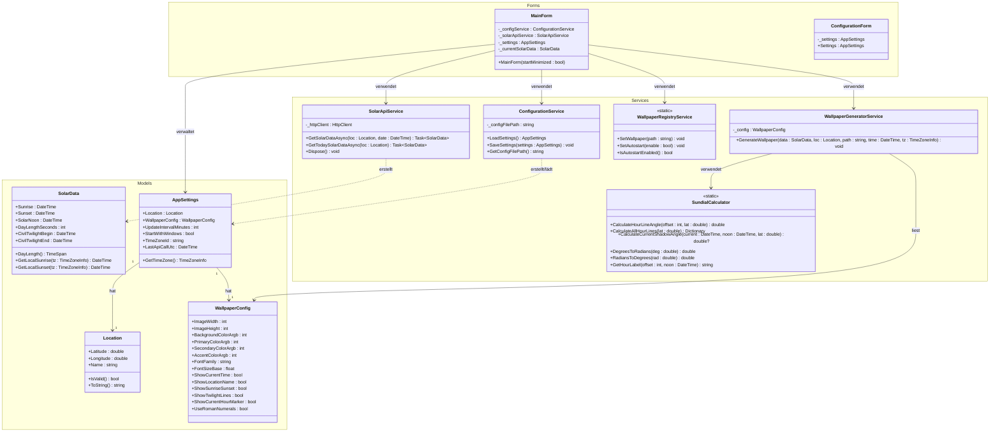

# Klassendiagramm (UML)

## Sonnenuhr – Standortspezifischer Wallpaper-Generator für Windows 11

---

| Feld | Inhalt |
|------|--------|
| **Projektname** | Sonnenuhr – Wallpaper-Generator |
| **Prüfling** | Uwe Markus Münch |
| **Stand** | 01.07.2026 |
| **Version** | 1.0 |

---

## UML-Klassendiagramm

Das folgende Diagramm zeigt die vollständige Klassenstruktur der Sonnenuhr-Anwendung mit allen Attributen, Methoden und Beziehungen zwischen den Klassen. Die Klassen sind in drei Namespaces organisiert: `Models`, `Services` und `Forms`.



---

## Klassenbeschreibungen

### Namespace: Models

#### `Location`

Die Klasse `Location` repräsentiert einen geografischen Standort mit Breitengrad (`Latitude`), Längengrad (`Longitude`) und einem benutzerdefinierten Namen (`Name`). Die Methode `IsValid()` prüft, ob die Koordinaten im gültigen Wertebereich liegen (Breitengrad: -90° bis +90°, Längengrad: -180° bis +180°). Diese Klasse dient als zentrales Datentransferobjekt für alle standortbezogenen Operationen und wird sowohl an die API-Service-Klasse als auch an den Taschenrechner für die Sonnenuhr-Geometrie übergeben.

#### `SolarData`

Die Klasse `SolarData` hält die von der Sunrise-Sunset-API zurückgelieferten astronomischen Daten für einen bestimmten Tag und Standort. Alle Zeitangaben werden intern in UTC gespeichert. Die berechnete Eigenschaft `DayLength` gibt die Tageslänge als `TimeSpan` zurück. Die Methoden `GetLocalSunrise()` und `GetLocalSunset()` konvertieren die UTC-Zeiten in die angegebene Zeitzone.

#### `WallpaperConfig`

Die Klasse `WallpaperConfig` kapselt alle Darstellungskonfigurationen für das zu generierende Wallpaper-Bild. Farben werden als ARGB-Integer-Werte gespeichert (Kompatibilität mit `System.Drawing.Color.FromArgb()`). Boolesche Felder steuern, welche optionalen Elemente (Uhrzeit, Ortsname, Dämmerungslinien usw.) auf dem Wallpaper dargestellt werden.

#### `AppSettings`

Die Klasse `AppSettings` ist das zentrale Konfigurationsobjekt der Anwendung. Es aggregiert `Location` und `WallpaperConfig` und enthält zusätzlich globale Einstellungen wie das Aktualisierungsintervall, den Autostart-Status, die Zeitzone und den Zeitstempel des letzten API-Aufrufs. Die Methode `GetTimeZone()` liefert das `TimeZoneInfo`-Objekt für die gespeicherte `TimeZoneId`.

---

### Namespace: Services

#### `SundialCalculator` (statisch)

Die Klasse `SundialCalculator` enthält die mathematische Kernlogik zur Berechnung der Sonnenuhr-Geometrie. Alle Methoden sind statisch. Die Stundenlinienwinkel werden nach der Formel für horizontale Sonnenuhren berechnet:

```
tan(H) = sin(φ) × tan(t)
```

wobei `φ` den geografischen Breitengrad und `t` den Stundenwinkel (15° pro Stunde) darstellt.

Die Methode `CalculateCurrentShadowAngle()` berechnet den aktuellen Schattenwinkel des Gnomons auf Basis der aktuellen Zeit und des Sonnenmittags. Sie gibt `null` zurück, wenn die Sonne nicht über dem Horizont steht (Nacht).

#### `SolarApiService`

Die Klasse `SolarApiService` kapselt alle Kommunikationslogik mit der externen Sunrise-Sunset-REST-API. Sie verwendet einen `HttpClient` für asynchrone HTTP-GET-Anfragen und `System.Text.Json` für die Deserialisierung der JSON-Antworten. Die Klasse implementiert `IDisposable`, um den `HttpClient` ordnungsgemäß freizugeben.

#### `WallpaperGeneratorService`

Die Klasse `WallpaperGeneratorService` ist für die Bildgenerierung zuständig. Sie nutzt die GDI+-Klassen aus `System.Drawing` (insbesondere `Graphics`, `Bitmap`, `Pen`, `Brush`, `Font`) um auf einem In-Memory-Bitmap die Sonnenuhr zu zeichnen. Die Klasse ruft intern `SundialCalculator.CalculateAllHourLines()` auf, um die Stundenlinien zu berechnen, und `CalculateCurrentShadowAngle()` für den Schattenzeiger. Das fertige Bild wird als PNG-Datei gespeichert.

#### `WallpaperRegistryService` (statisch)

Die Klasse `WallpaperRegistryService` kapselt alle Interaktionen mit der Windows Registry. Die Methode `SetWallpaper()` schreibt den Bildpfad in `HKCU\Control Panel\Desktop\Wallpaper` und ruft `SystemParametersInfo(SPI_SETDESKWALLPAPER, ...)` auf, um den Desktop-Hintergrund sofort zu aktualisieren. Die Methoden `SetAutostart()` und `IsAutostartEnabled()` verwalten den Autostart-Eintrag unter `HKCU\Software\Microsoft\Windows\CurrentVersion\Run`.

#### `ConfigurationService`

Die Klasse `ConfigurationService` verwaltet das Laden und Speichern der Benutzereinstellungen. Einstellungen werden als JSON-Datei unter `%APPDATA%\Sonnenuhr\settings.json` persistiert. Beim Laden wird geprüft, ob die Datei existiert; falls nicht, werden Standardwerte zurückgegeben. Die Serialisierung und Deserialisierung erfolgt über `System.Text.Json.JsonSerializer`.

---

### Namespace: Forms

#### `MainForm`

`MainForm` ist das Hauptfenster der Anwendung und der zentrale Koordinator. Es instanziiert und orchestriert die Service-Klassen, verwaltet den Timer für die automatische Aktualisierung, zeigt aktuelle Sonnendaten an und bietet dem Benutzer Schaltflächen zur manuellen Aktualisierung und zum Öffnen des Konfigurationsdialogs. Der Konstruktor akzeptiert einen `startMinimized`-Parameter, der beim Autostart verwendet wird.

#### `ConfigurationForm`

`ConfigurationForm` ist ein modaler Dialog, über den der Benutzer alle Darstellungsoptionen des Wallpapers konfigurieren kann. Das Formular empfängt eine Kopie des aktuellen `AppSettings`-Objekts, und die bearbeiteten Einstellungen sind nach dem Schließen über die öffentliche Eigenschaft `Settings` abrufbar. Bei Abbruch (Schaltfläche „Abbrechen") werden alle Änderungen verworfen.

---

*Dokument erstellt von: Uwe Markus Münch | Breihof IT GmbH | IHK Rhein-Neckar | 01.07.2026*
