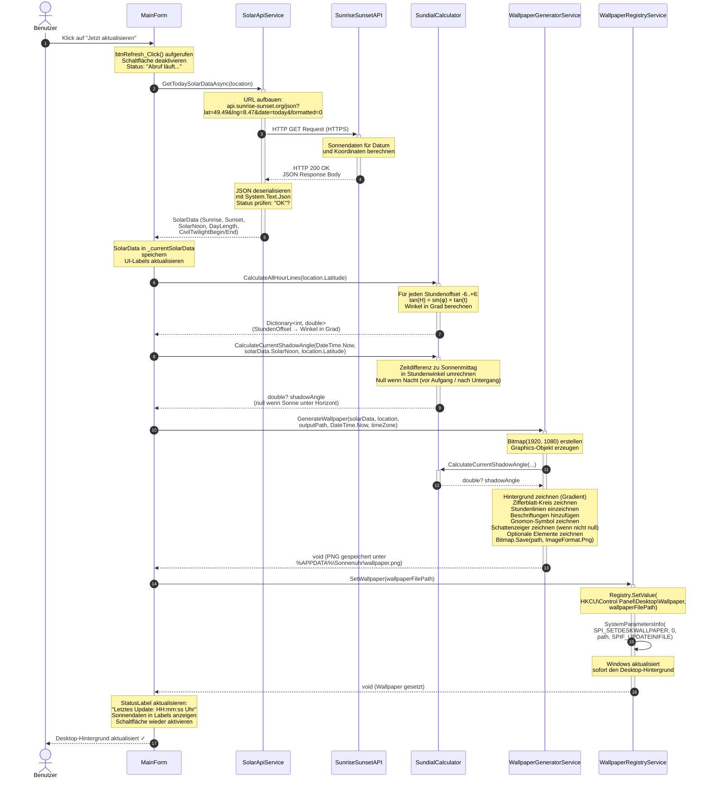
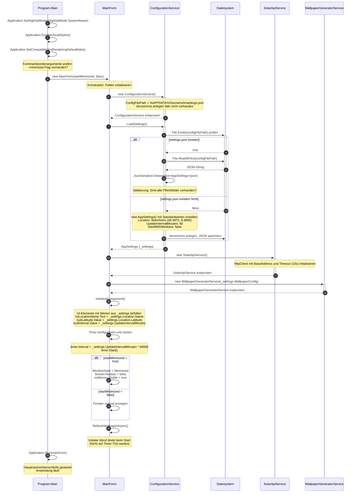
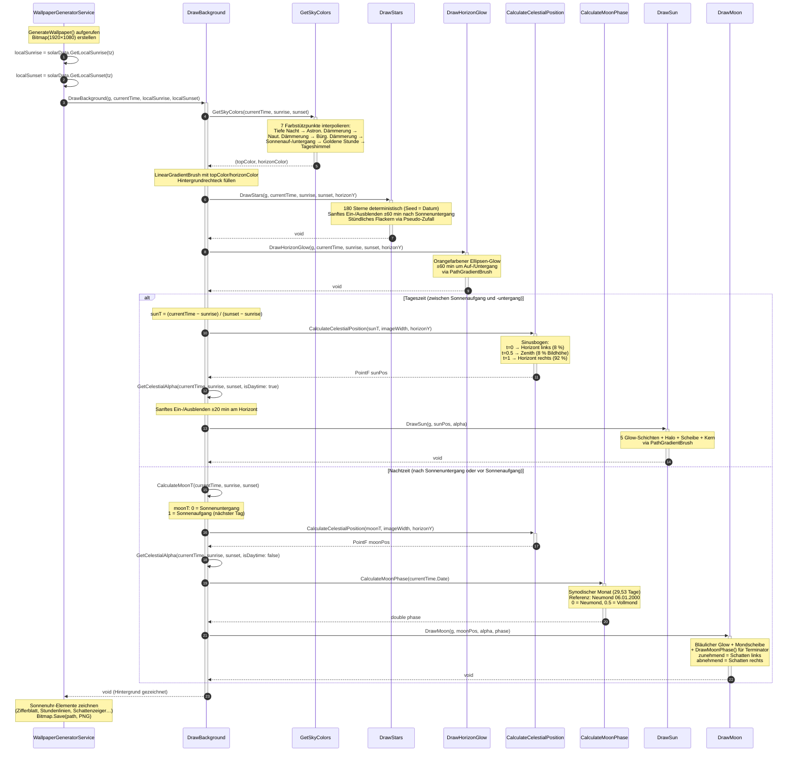

# Sequenzdiagramm

## Sonnenuhr – Standortspezifischer Wallpaper-Generator für Windows 11

---

| Feld | Inhalt |
|------|--------|
| **Projektname** | Sonnenuhr – Wallpaper-Generator |
| **Prüfling** | Uwe Markus Münch |
| **Stand** | 01.07.2026 |
| **Version** | 1.0 |

---

## Inhaltsverzeichnis

1. [Sequenzdiagramm 1: Wallpaper-Generierung](#1-sequenzdiagramm-wallpaper-generierung)
2. [Sequenzdiagramm 2: Anwendungsstart](#2-sequenzdiagramm-anwendungsstart)
3. [Sequenzdiagramm 3: Konfigurationsänderung](#3-sequenzdiagramm-konfigurationsänderung)
4. [Sequenzdiagramm 4: Stadtsuche](#4-sequenzdiagramm-stadtsuche)
5. [Sequenzdiagramm 5: Animierter Hintergrund](#5-sequenzdiagramm-animierter-hintergrund)

---

## 1. Sequenzdiagramm: Wallpaper-Generierung

### 1.1 Beschreibung

Dieses Sequenzdiagramm zeigt die vollständige Interaktionskette aller beteiligten Komponenten bei der Generierung und dem Setzen eines neuen Desktop-Wallpapers. Das Szenario wird entweder durch einen Timer-Tick (automatisch) oder durch einen manuellen Klick des Benutzers auf „Jetzt aktualisieren" ausgelöst.

Die Abfolge umfasst folgende Hauptschritte:
1. Auslösung durch den Benutzer oder Timer
2. Asynchroner API-Aufruf zur Beschaffung der Sonnendaten
3. Geometrische Berechnung der Sonnenuhr-Elemente
4. Bildgenerierung mit GDI+
5. Systemintegration über Windows Registry

### 1.2 Sequenzdiagramm



### 1.3 Fehlerszenarien

```mermaid
sequenceDiagram
    autonumber
    actor Benutzer
    participant MF as MainForm
    participant SAS as SolarApiService
    participant API as SunriseSunsetAPI

    Benutzer->>MF: Klick auf "Jetzt aktualisieren"
    MF->>+SAS: GetTodaySolarDataAsync(location)
    SAS->>+API: HTTP GET Request (HTTPS)

    alt Netzwerk nicht verfügbar
        API-->>SAS: Timeout nach 10 Sekunden
        Note over SAS: TaskCanceledException<br/>oder HttpRequestException
        SAS-->>-MF: Exception ausgelöst
        Note over MF: Catch-Block im try/catch<br/>Fehler in sonnenuhr.log schreiben
        MF-->>Benutzer: StatusLabel: "Fehler: Netzwerk nicht verfügbar"

    else API antwortet mit Fehler
        API-->>SAS: HTTP 200 OK<br/>Status: "INVALID_REQUEST"
        Note over SAS: Status != "OK" erkannt
        SAS-->>-MF: Exception: "API returned status: INVALID_REQUEST"
        Note over MF: Fehler protokollieren
        MF-->>Benutzer: StatusLabel: "Fehler: Ungültige Koordinaten"
    end

    Note over MF: Letztes gültiges Wallpaper<br/>bleibt als Hintergrund bestehen
```

---

## 2. Sequenzdiagramm: Anwendungsstart

### 2.1 Beschreibung

Dieses Sequenzdiagramm zeigt den vollständigen Startvorgang der Anwendung, vom Aufruf des Einstiegspunkts `Program.Main` bis zum Abschluss der Initialisierung und der ersten Wallpaper-Generierung.



---

## 3. Sequenzdiagramm: Konfigurationsänderung

### 3.1 Beschreibung

Dieses Sequenzdiagramm zeigt den Ablauf, wenn der Benutzer die Anwendungskonfiguration über den Konfigurationsdialog ändert.

```mermaid
sequenceDiagram
    autonumber
    actor Benutzer
    participant MF as MainForm
    participant CF as ConfigurationForm
    participant CS as ConfigurationService
    participant WRS as WallpaperRegistryService
    participant WGS as WallpaperGeneratorService

    Benutzer->>MF: Klick auf "⚙ Darstellung"

    MF->>+CF: new ConfigurationForm(_settings.WallpaperConfig)
    Note over CF: Formularfelder mit aktuellen Werten befüllen:<br/>Farbpaletten, Schriftarten, Checkboxen

    CF-->>-MF: ConfigurationForm instanziiert

    MF->>+CF: ShowDialog()
    Note over CF: Modaler Dialog öffnet sich<br/>Benutzer kann Einstellungen ändern

    Benutzer->>CF: Farben / Schriften / Optionen ändern

    alt Benutzer klickt "OK"
        Benutzer->>CF: Klick auf "OK" (btnOk_Click)
        CF->>CF: Eingaben validieren
        Note over CF: Intervall-Wert prüfen (1 ≤ x ≤ 1440 Min.)<br/>Schriftgröße prüfen (6 ≤ x ≤ 72 pt)
        CF->>CF: DialogResult = OK
        CF-->>-MF: DialogResult.OK

        MF->>MF: _settings.WallpaperConfig = cf.Settings.WallpaperConfig
        Note over MF: Neue Einstellungen in _settings übernehmen

        MF->>+CS: SaveSettings(_settings)
        Note over CS: JsonSerializer.Serialize(_settings)<br/>File.WriteAllText(configFilePath, json)
        CS-->>-MF: void (gespeichert)

        alt Autostart geändert
            MF->>+WRS: SetAutostart(_settings.StartWithWindows)
            Note over WRS: Registry-Eintrag setzen oder löschen:<br/>HKCU\Software\Microsoft\Windows\CurrentVersion\Run
            WRS-->>-MF: void
        end

        MF->>MF: Timer-Intervall aktualisieren
        Note over MF: timer.Stop()<br/>timer.Interval = newInterval * 60000<br/>timer.Start()

        MF->>+WGS: _config = _settings.WallpaperConfig
        Note over WGS: Neue Konfiguration übernehmen
        WGS-->>-MF: void

        MF->>MF: RefreshWallpaperAsync()
        Note over MF: Wallpaper sofort neu generieren<br/>Benutzer sieht Änderungen sofort

        MF-->>Benutzer: Wallpaper aktualisiert ✓

    else Benutzer klickt "Abbrechen"
        Benutzer->>CF: Klick auf "Abbrechen"
        CF->>CF: DialogResult = Cancel
        CF-->>MF: DialogResult.Cancel
        Note over MF: Keine Änderungen übernommen<br/>_settings bleibt unverändert
        MF-->>Benutzer: Dialog geschlossen (keine Änderungen)
    end
```



---

## Zusammenfassung der Interaktionspartner

| Komponente | Rolle | Kommunikationsrichtung |
|------------|-------|----------------------|
| **Benutzer** | Auslöser von Aktionen | → MainForm |
| **MainForm** | Orchestrator / Koordinator | ↔ alle Services |
| **SolarApiService** | Datenbeschaffung | → externe API |
| **SunriseSunsetAPI** | Externe Datenquelle | → SolarApiService |
| **SundialCalculator** | Rechenlogik (statisch) | → MainForm, WallpaperGeneratorService |
| **WallpaperGeneratorService** | Bildgenerierung | → Dateisystem |
| **WallpaperRegistryService** | Systemintegration (statisch) | → Windows Registry |
| **ConfigurationService** | Datenpersistenz | → Dateisystem |
| **ConfigurationForm** | Benutzereingabe | ↔ MainForm |

---

## 4. Sequenzdiagramm: Stadtsuche

### 4.1 Beschreibung

Dieses Sequenzdiagramm zeigt den Ablauf der Stadtsuche. Der Benutzer gibt
einen Stadtnamen ein und klickt auf den Suchen-Button. Je nach Anzahl der
gefundenen Treffer werden die Koordinaten direkt übernommen oder ein
Auswahldialog öffnet sich.

```mermaid
sequenceDiagram
    autonumber
    actor Benutzer
    participant MF as MainForm
    participant GS as GeocodingService
    participant NOM as Nominatim API
    participant CSF as CitySelectionForm

    Benutzer->>MF: Stadtname eingeben und "Suchen" klicken
    Note over MF: btnCitySearch_Click()<br/>btnCitySearch.Enabled = false<br/>Status: "Suche nach ..."

    MF->>+GS: SearchCityAsync(query)
    Note over GS: URL aufbauen:<br/>nominatim.openstreetmap.org/search?<br/>q={query}&format=jsonv2&featuretype=settlement

    GS->>+NOM: HTTP GET (User-Agent: Sonnenuhr/1.0)
    Note over NOM: Ortsname-Abfrage verarbeiten<br/>bis zu 10 Ergebnisse

    NOM-->>-GS: HTTP 200 OK<br/>JSON-Array mit GeocodingResult[]

    Note over GS: JSON deserialisieren<br/>Nach Importance absteigend sortieren

    GS-->>-MF: IReadOnlyList<GeocodingResult>

    alt 0 Treffer
        Note over MF: MessageBox: "Keine Orte gefunden.<br/>Tipp: Länderzusatz verwenden"
    else 1 Treffer
        Note over MF: ApplyCityResult(results[0])
        MF->>MF: txtLocationName = ShortName
        MF->>MF: txtLatitude = Latitude (F4, InvariantCulture)
        MF->>MF: txtLongitude = Longitude (F4, InvariantCulture)
        MF->>MF: Settings speichern
        MF-->>Benutzer: Koordinaten übernommen
    else Mehrere Treffer
        MF->>+CSF: new CitySelectionForm(results, query)
        Note over CSF: ListBox mit allen Treffern<br/>aufsteigend nach Importance sortiert

        CSF-->>-MF: Dialog instanziiert

        MF->>+CSF: ShowDialog()
        CSF-->>Benutzer: Auswahldialog zeigen

        Benutzer->>CSF: Treffer auswählen
        Note over CSF: Koordinaten-Vorschau aktualisieren

        alt Benutzer klickt "Auswählen"
            Benutzer->>CSF: Klick auf Auswählen
            CSF->>CSF: SelectedResult = gewählter Eintrag
            CSF->>CSF: DialogResult = OK
            CSF-->>-MF: DialogResult.OK

            MF->>MF: ApplyCityResult(selectionForm.SelectedResult)
            MF-->>Benutzer: Koordinaten übernommen

        else Benutzer klickt "Abbrechen"
            Benutzer->>CSF: Klick auf Abbrechen
            CSF-->>-MF: DialogResult.Cancel
            Note over MF: Keine Änderungen
        end
    end

    Note over MF: btnCitySearch.Enabled = true<br/>Status aktualisieren
```

### 4.2 Fehlerszenario: Netzwerkfehler bei Stadtsuche
    MF->>+GS: SearchCityAsync(query)
    GS->>+NOM: HTTP GET Request

    alt Netzwerk nicht verfügbar
        NOM-->>GS: Timeout nach 15 Sekunden
        GS-->>-MF: HttpRequestException
        Note over MF: Catch-Block: MessageBox mit Fehlermeldung<br/>Status: "Fehler bei der Stadtsuche"
        MF-->>Benutzer: Fehler-Dialog angezeigt
    end

    Note over MF: btnCitySearch.Enabled = true (finally-Block)
```

---

## 5. Sequenzdiagramm: Animierter Hintergrund

### 5.1 Beschreibung

Dieses Sequenzdiagramm zeigt die interne Aufrufkette innerhalb von `WallpaperGeneratorService`, die beim Zeichnen des animierten Hintergrunds durchlaufen wird. Der Einstiegspunkt ist `GenerateWallpaper()`. Vor dem eigentlichen Zeichnen werden die lokalen Sonnenauf- und -untergangszeiten berechnet und als Parameter an `DrawBackground()` übergeben. Je nach Tageszeit werden Sonne oder Mond gezeichnet; Sterne, Horizontglühen und Himmelsfarbe werden immer berechnet.



### 5.2 Erläuterung der Schlüsselentscheidungen

| Entscheidung | Bedingung | Auswirkung |
|---|---|---|
| **Sonne oder Mond zeichnen?** | `currentTime` zwischen `localSunrise` und `localSunset` | Tag → `DrawSun()`; Nacht → `DrawMoon()` |
| **Sterne anzeigen?** | `currentTime` nahe/nach Sonnenuntergang oder vor Sonnenaufgang | Sanftes Einblenden ab 60 min nach Untergang |
| **Horizontglühen aktiv?** | `|currentTime − sunrise| ≤ 60 min` oder `|currentTime − sunset| ≤ 60 min` | Orangefarbener Glow proportional zur Nähe |
| **Alpha-Überblendung** | ±20 min nahe Horizont | Sonne/Mond werden weich ein-/ausgeblendet |

---

*Dokument erstellt von: Uwe Markus Münch | Breihof IT GmbH | IHK Rhein-Neckar | 01.07.2026*
